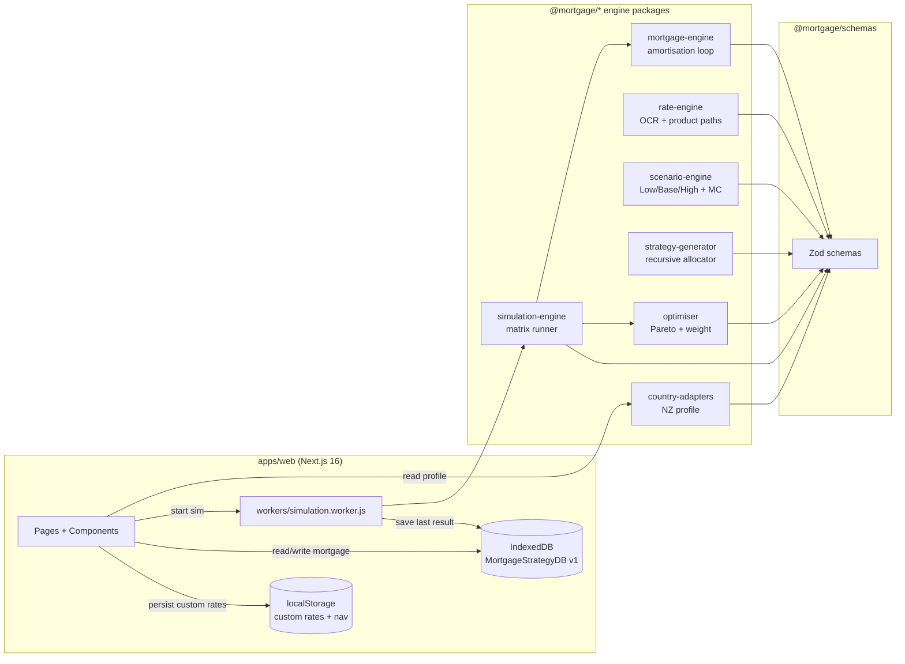
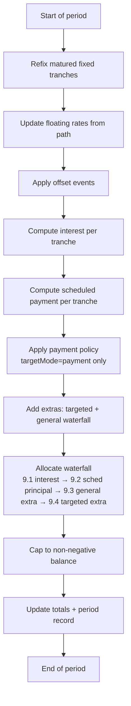
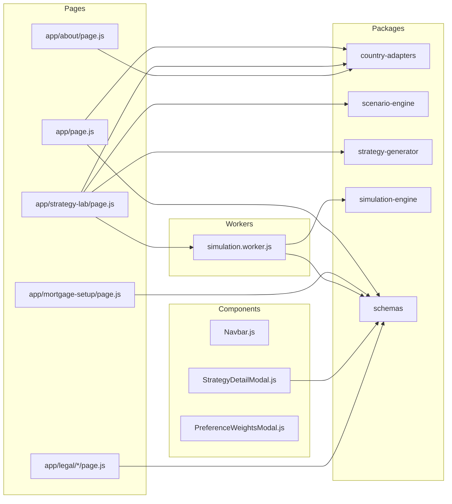

# RatePath

> **Privacy-first NZ mortgage strategy simulator.** All math runs in your browser; nothing is uploaded; nothing leaves your device.

RatePath is a New Zealand mortgage strategy simulation web app. You enter your loan structure (tranches, repayment type, frequency), the app simulates future cash flows under low / base / high interest-rate scenarios, generates candidate split strategies, runs the matrix through an amortisation engine in a Web Worker, and ranks the results with a multi-objective optimiser (Pareto frontier + weighted scoring). The UI is fully bilingual (`en-NZ` and `zh-CN`).

It is **not** a financial advisor, broker, or quote engine — it is a local-first simulation tool for exploring how different fixed/floating mixes perform across plausible rate paths. See [`/legal/disclaimer`](/apps/web/app/legal/disclaimer/page.js) for the full terms.

---

## Features

- **Local-only compute.** Mortgage data lives in IndexedDB; simulations run in a Web Worker; nothing is uploaded to any server.
- **Multi-scenario simulation.** Three deterministic future OCR paths (low / base / high) plus a Monte Carlo tail beyond month 36.
- **Split-strategy enumeration.** Recursive grid allocator explores all valid `maxSplits × percentageStep` combinations subject to floating caps, fixed floors, and min-tranche-amount rules.
- **Multi-objective ranking.** 6-axis Pareto classification + weighted scoring across cost, worst-case cost, worst-case payment, refix concentration, affordability breaches, and flexibility penalty.
- **Customisable preference weights.** 5 sliders (cost / refix / flex / balance / worst-case defence) feed only the "Preference-matched" recommendation card.
- **OCR-anchored rate editor.** Adjusting the OCR slider shifts every product rate by the same margin, preserving each product's spread.
- **Bilingual UI.** Full `en-NZ` (default) + `zh-CN` (fallback) coverage with a segment toggle in the navbar; `lookupDeep` falls back to the other locale if a key is missing.
- **No backend.** Single static deployment; everything happens in the browser.

---

## How it works

```
┌────────────┐     ┌──────────────┐     ┌────────────┐
│ Dashboard  │ ──▶ │ Mortgage     │ ──▶ │ Strategy   │
│ /          │     │ Setup        │     │ Lab        │
│ (rates,    │     │ /mortgage-   │     │ /strategy- │
│  summary)  │     │ setup        │     │ lab        │
└────────────┘     └──────────────┘     └─────┬──────┘
                                               │
                  ┌────────────────────────────┘
                  ▼
         ┌──────────────────┐         ┌─────────────────┐
         │ Web Worker       │ ──────▶ │ Optimiser       │
         │ strategy ×       │         │ Pareto + weight │
         │ scenario matrix  │         │ ───▶ 4 rec cards │
         └──────────────────┘         └─────────────────┘
```

1. **Set up your mortgage** (balance, frequency, repayment type) — saved to IndexedDB.
2. **Tune market rates** on the Dashboard (OCR + per-product margins, anchored to OCR).
3. **Run a simulation** on the Strategy Lab page with your constraints + preferences.
4. The Worker streams `progress` messages; the result renders 4 recommendation cards (Preference / Lowest Cost / Most Stable / Worst-Case Defence) and a Pareto scatter.

---

## System architecture



**Boundary rule:** the UI never computes. Pages post `mortgage + strategies + scenarios + ...` to the Worker; the Worker calls `simulateStrategyScenarioMatrix` from `@mortgage/simulation-engine`. The page reads `{ type: "progress" | "success" | "cached" | "error" }` messages back.

---

## Simulation pipeline

```mermaid
sequenceDiagram
    actor U as User
    participant SL as Strategy Lab page
    participant W as Web Worker
    participant SIM as simulateStrategyScenarioMatrix
    participant OPT as optimizeStrategies
    participant UI as Results panel

    U->>SL: Click "Start simulation"
    SL->>SL: generateSplitStrategies()
    SL->>SL: generateScenarios()
    SL->>W: postMessage({ mortgage, strategies, scenarios, ... })
    W->>SIM: iterate (scenario × strategy)
    loop every 10 completions
        SIM-->>W: onProgress(completed, total)
        W-->>SL: postMessage({ type: "progress" })
        SL->>UI: update progress bar + current grid
    end
    SIM-->>W: results[]
    W->>W: stableStringify + LRU(1) cache check
    W-->>SL: postMessage({ type: "success" | "cached", results, key })
    W->>W: saveResults to IndexedDB
    SL->>OPT: optimizeStrategies(results)
    OPT-->>SL: 4 rec cards + Pareto + table
    SL->>UI: render cards / chart / table
    U->>UI: click any card
    UI->>SL: open StrategyDetailModal (lazy-load timeline)
    SL->>W: per-strategy detail request
    W-->>SL: full timeline + refix events
    SL->>UI: render modal
```

---

## Algorithm deep-dive (summary)

For the full algorithm walkthrough, see [`docs/SIMULATION_README.md`](docs/SIMULATION_README.md) (中文).

### 1. Policy rate path — `buildPolicyRatePath`

`@mortgage/rate-engine` builds an OCR (Official Cash Rate) forecast with a piecewise curve: a power-curve transition for months 0–12, then linear trend to month 36, then flat.

```
rate
 ^
 |       (changeSpeed=0.1, slow)  rate = init + Δ·(m/12)^1.9
 |      ───────────────────────────
 |     ╱
 |    ╱   (changeSpeed=0.5)  rate = init + Δ·(m/12)^1.0  (linear)
 |   ╱  ─────────────────────────────
 |  ╱
 | ╱ (changeSpeed=1.0, fast)  rate = init + Δ·(m/12)^0.1
 |╱ ─────────────────────────────
 └─────────────────────────────────▶ month
   0    3    6    9   12   18   24   36
```

For `month > 12`: linear trend at `mediumTermDirection × 0.005 / year`; holds flat after month 36.

### 2. Uncertainty ramp — `getUncertaintyFactor`

`@mortgage/scenario-engine` widens the low/high shocks over time, so short-term forecasts stay tight but long-term uncertainty grows.

```
factor
  1.0 ┤                              ●─────────────
      │                           ╱
  0.5 ┤                  ●─────╱
      │               ╱
  0.25┤        ●────╱
      │      ╱
    0 ┤●────
      └──┬──┬──┬──┬──┬──┬──┬──┬──▶ month
         0  3  6  9 12 ...
```

`lowRate(t) = baseRate(t) − uncertainty × factor(t)` and `highRate(t) = baseRate(t) + uncertainty × factor(t)`.

### 3. Strategy generator — PR-1..PR-6 pruning

`@mortgage/strategy-generator` is a recursive grid allocator. The unpruned space is `stepCount^N` (e.g. `21^7 ≈ 1.8B` at step=0.05 with 7 products). Six pruning rules cut this to a few hundred thousand calls in the spec golden case.

**Worked example** (`totalAmount=600000`, `maxSplits=2`, `percentageStep=0.25`, products `[floating, fixed-1y, fixed-2y]`):

```
0%──25%──50%──75%──100%  ← percentage axis
├────┼─────┼─────┼────┤
│  100% floating
│  75% floating + 25% fixed-1y
│  50% floating + 50% fixed-1y
│  25% floating + 75% fixed-1y
│  100% fixed-1y
│  ... (and similarly with fixed-2y)
│  → leaves pruned by PR-1 if floating > 30% cap
│  → leaves pruned by PR-4 if amount < 10,000
│  → leaves deduped by PR-5 sorted productCode key
```

For a full worked tree, see [`docs/SIMULATION_README.md`](docs/SIMULATION_README.md#拆分组合生成).

### 4. Per-period amortisation loop

`@mortgage/mortgage-engine`'s `simulateMortgageTimeline` is the heart of the system. Each period (weekly / fortnightly / monthly) executes 12 ordered steps:



**Extras waterfall** (9.3): general extra repayments are sorted via `sortTranchesForExtraRepayment` (floating/offset/revolving first, then by descending `annualRate`) and allocated in order, capped to remaining principal.

### 5. Pareto dominance (6 axes)

`@mortgage/optimiser` classifies each strategy as Pareto-optimal if no other strategy is at least as good on every axis AND strictly better on at least one. Default tolerances (term mode):

| Axis | Tolerance | Direction |
|------|-----------|-----------|
| `expectedInterest` | $20 | minimise |
| `worstCaseInterest` | $50 | minimise |
| `worstCasePayment` | $10 | minimise |
| `expectedMaxConcurrentRefixPercentage` | 0.02 | minimise |
| `expectedAffordabilityBreaches` | 1 | minimise |
| `flexibilityPenalty` | 0.02 (= 1 − expectedFloatingExposure) | minimise |

The "Preference-matched" card is the only one that uses the user's weight sliders; the other three (Lowest Cost / Most Stable / Worst-Case Defence) are weights-independent and use a v11 tiebreaker (lower concentration wins on tie).

For the full optimiser specification, see [`docs/SIMULATION_README.md`](docs/SIMULATION_README.md#多目标优化).

---

## Quickstart

```bash
# from repo root
npm install
npm run dev          # Next.js dev server on http://localhost:4321
npm test             # vitest run (all @mortgage/* packages)
npm run lint         # eslint .
npm run check        # tsc -p jsconfig.json --noEmit
```

Open `http://localhost:4321`, click "Set up mortgage" → fill in loan amount / frequency / repayment type → save. Then go to the Strategy Lab page and click "Start simulation".

The first time you run, all rates default to the built-in NZ market defaults (OCR = 2.25%, 7 products, 2026-06-17 snapshot). You can override any rate on the Dashboard.

---

## Project layout

```text
ratepath/
├── apps/
│   └── web/                  # Next.js 16 front-end (port 4321)
│       ├── app/              # App Router pages
│       ├── components/       # UI primitives
│       ├── features/         # storage.js (IndexedDB)
│       ├── lib/i18n/         # i18n provider + formatters
│       ├── messages/         # en-NZ.json + zh-CN.json
│       └── workers/          # simulation.worker.js
├── packages/                 # 8 algorithm packages, all ESM
│   ├── schemas/              # Zod schemas (single source of truth)
│   ├── country-adapters/     # NZ profile + beta sensitivities
│   ├── rate-engine/          # OCR + product rate paths
│   ├── scenario-engine/      # Low/Base/High + Monte Carlo
│   ├── strategy-generator/   # Recursive grid allocator
│   ├── mortgage-engine/      # Per-period amortisation loop
│   ├── simulation-engine/    # Strategy × scenario matrix runner
│   └── optimiser/            # Pareto + weighted ranking + pros/cons
├── docs/
│   └── SIMULATION_README.md  # Chinese algorithm deep-dive
├── CLAUDE.md                 # Monorepo guide for AI agents
├── README-AGENTS.md          # Agent workflow notes
└── LEGAL_REVIEW.md           # Legal-counsel review workstream tracker
```

---

## File-to-package map



**Pages never call engine math directly.** They compose the input, post to the Worker, and read back messages.

---

## Privacy & legal

- **All math runs in your browser.** No mortgage data, scenarios, or results leave your device. No analytics. No tracking.
- **Data lives in IndexedDB** (`MortgageStrategyDB` v1, 5 stores: `mortgages`, `scenarios`, `constraints`, `savedResults`, `marketCache`) and `localStorage` (custom market rates, navbar collapse flag).
- **Build id is stamped at `next build`** (`NEXT_PUBLIC_BUILD_ID = git rev-parse --short HEAD || "dev"`) and displayed on the About page.
- The app explicitly **does not** connect to any external market data source. The rates shown on the page come from only two sources: the app's built-in demo defaults and your manual adjustments on the Dashboard.
- Governed by New Zealand law. Read the full terms at [`/legal/disclaimer`](/apps/web/app/legal/disclaimer/page.js) and the privacy notice at [`/legal/privacy`](/apps/web/app/legal/privacy/page.js).
- New Zealand statutory anchors: **Consumer Guarantees Act 1993**, **Fair Trading Act 1986**, **Privacy Act 2020** (Office of the Privacy Commissioner complaint rights preserved).
- A separate `LEGAL_REVIEW.md` workstream tracks the engagement of qualified NZ legal counsel for a full review of the disclaimer and privacy texts.

---

## Limitations & non-goals

- **Not financial advice.** The recommendations are pure mathematical orderings. They do not constitute professional financial, lending, tax, or legal advice.
- **Rates are estimates.** Built-in defaults are demonstration values, not market quotes. The model does not connect to any bank's live rate feed.
- **Monte Carlo is not a forecast.** The 36-month-plus tail is sampled from a mean-reverting model with a user-configurable reversal bias; it is a sensitivity analysis, not a prediction.
- **OCR-anchored rate editing is a UI convention.** It is not a market model. Real banks reprice products on different cycles; the engine approximates this with a single Beta coefficient per product.
- **One product catalogue.** Only New Zealand (OCR + 7 products) is currently implemented. Adding a new market means writing a new `country-adapters/src/<cc>.js` and a Zod-validated `MarketProfile`.

---

## Contributing

- **For new contributors:** read [`apps/web/CLAUDE.md`](apps/web/CLAUDE.md) (Next 16, port 4321, styling rules) and [`apps/web/AGENTS.md`](apps/web/AGENTS.md) (Next 16 has breaking changes vs. training data; read `node_modules/next/dist/docs/` first).
- **For algorithm work:** read [`CLAUDE.md`](CLAUDE.md) (monorepo guide) and the per-package tests in `packages/*/tests/`.
- **For AI agents:** read [`README-AGENTS.md`](README-AGENTS.md) (model inheritance / workflow notes) and use the `mortgage-algorithm-architect` agent for design-first algorithm changes.
- **For Chinese-speaking algorithm reviewers:** [`docs/SIMULATION_README.md`](docs/SIMULATION_README.md) is the user-facing distillation of the per-package specs.

---

## Related docs

- [`apps/web/README.md`](apps/web/README.md) — operator/developer guide for the Next.js front-end
- [`apps/web/CLAUDE.md`](apps/web/CLAUDE.md) — web app developer guide
- [`apps/web/AGENTS.md`](apps/web/AGENTS.md) — Next.js 16 caveat
- [`CLAUDE.md`](CLAUDE.md) — monorepo guide
- [`docs/SIMULATION_README.md`](docs/SIMULATION_README.md) — Chinese algorithm deep-dive
- [`LEGAL_REVIEW.md`](LEGAL_REVIEW.md) — legal-counsel review workstream
