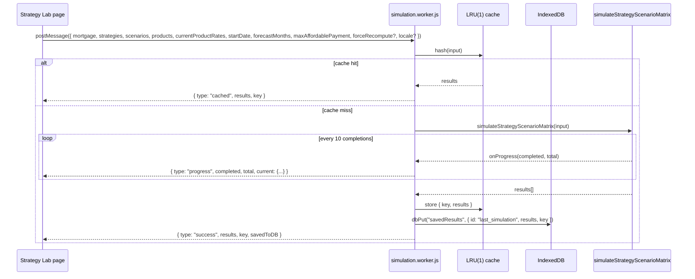

# `apps/web` — RatePath Web App

> Next.js 16.2.9 front-end for the RatePath mortgage strategy simulation monorepo. UI is bilingual (`en-NZ` + `zh-CN`); all default data is for the New Zealand mortgage market. The web app is a thin presentation layer over `@mortgage/*` engine packages — it does **no** financial computation itself; everything heavy runs in `workers/simulation.worker.js`.

See also:

- [`../README.md`](../README.md) — top-level project pitch, architecture, algorithm summary
- [`./CLAUDE.md`](./CLAUDE.md) — developer guide (directory layout, persistence model, styling rules)
- [`./AGENTS.md`](./AGENTS.md) — Next.js 16 has breaking changes vs. training data; read `node_modules/next/dist/docs/` first
- [`../docs/SIMULATION_README.md`](../docs/SIMULATION_README.md) — Chinese algorithm deep-dive

---

## What this is

- **Next.js 16.2.9** (App Router, React 19.2.4) on port **4321**
- **styled-jsx** for component styles, CSS variables for design tokens
- **No build pipeline for packages** — `@mortgage/*` deps are pinned to `*` and consumed by source via path aliases
- **Worker boundary** — `workers/simulation.worker.js` is the only place that imports `@mortgage/simulation-engine`
- **Bilingual** — `messages/{en-NZ,zh-CN}.json`; `lib/i18n/I18nProvider.jsx` provides `t()`, `formatMoney`, etc.

---

## Quickstart

```bash
# from repo root
npm install
npm run dev          # next dev on http://localhost:4321
npm run build        # stamps NEXT_PUBLIC_BUILD_ID=$(git rev-parse --short HEAD || dev) then next build
npm run start        # next start on port 4321
npm run lint         # eslint (uses apps/web/eslint.config.mjs)
npm run test:app     # vitest in this package only
```

`build` stamps a short git SHA into `process.env.NEXT_PUBLIC_BUILD_ID`; the About page reads it (falls back to `"dev"` outside a git checkout). `eslint-config-next@16.2.9` is pinned to match the bundled Next — don't bump it independently.

---

## Available scripts

| Script | What it does |
| ------ | ------------ |
| `dev` | `next dev -p 4321` |
| `build` | Set `NEXT_PUBLIC_BUILD_ID`, then `next build` |
| `start` | `next start -p 4321` |
| `lint` | `eslint` (uses `apps/web/eslint.config.mjs`) |
| `test:app` | vitest in this package only |
| `test:app:watch` | vitest watch mode |

---

## Directory layout

```text
apps/web/
├── app/
│   ├── layout.js                  # Root layout: en-NZ <html>, Navbar, StyledJsxRegistry
│   ├── page.js                    # Dashboard (default route "/")
│   ├── mortgage-setup/page.js     # Mortgage + tranche configuration
│   ├── strategy-lab/page.js       # Strategy Lab — main simulation driver (~3000 lines)
│   ├── about/page.js              # Market config, privacy, build info
│   ├── legal/
│   │   ├── disclaimer/page.js     # Full disclaimer (17 sections)
│   │   └── privacy/page.js        # Privacy notice (8 sections)
│   ├── registry.js                # styled-jsx SSR registry (Server Component)
│   └── globals.css                # Global dark-mode design tokens (CSS variables)
├── components/
│   ├── Navbar.js                  # Collapsible sidebar (persists to localStorage)
│   ├── NumberInput.js             # Numeric input primitive
│   ├── Select.js                  # Dark-mode dropdown with listbox semantics
│   ├── Text.js                    # Typography primitive
│   ├── SvgChart.js                # Inline SVG chart helper
│   ├── PreferenceWeightsModal.js  # Modal for 5 preference sliders
│   ├── StrategyDetailModal.js     # Full strategy detail with timeline
│   ├── I18nShell.jsx              # I18nProvider + DocumentTitleSync wrapper
│   └── index.js                   # barrel re-exports
├── features/
│   └── storage.js                 # IndexedDB wrapper (openDB, dbGet, dbPut, dbGetAll, dbDelete)
├── lib/
│   └── i18n/                      # I18nProvider, useI18n, dictionaries, formatters, LanguageSwitcher
├── messages/
│   ├── en-NZ.json                 # English (default SSR locale)
│   └── zh-CN.json                 # Simplified Chinese (fallback locale)
└── workers/
    └── simulation.worker.js       # Only place that imports @mortgage/simulation-engine
```

---

## Routing map

| Path | Page | Purpose |
| ---- | ---- | ------- |
| `/` | `app/page.js` | Dashboard: read OCR/floating/fixed-6m..5y rates, edit custom market rates, link to setup/strategy-lab. |
| `/mortgage-setup` | `app/mortgage-setup/page.js` | Mortgage + tranche configuration, persisted to IndexedDB `mortgages` store. |
| `/strategy-lab` | `app/strategy-lab/page.js` | Sliders + constraints + preference weights. Posts the full simulation matrix to the worker. |
| `/about` | `app/about/page.js` | Market config (NZ), privacy notice summary, disclaimer summary, build info. |
| `/legal/disclaimer` | `app/legal/disclaimer/page.js` | Full disclaimer and terms of use (NZ CGA 1993, FTA 1986, Privacy Act 2020 cited). |
| `/legal/privacy` | `app/legal/privacy/page.js` | Full privacy notice (IndexedDB-only, no upload). |

---

## Worker boundary

`workers/simulation.worker.js` is the **single** call site for `simulateStrategyScenarioMatrix` from `@mortgage/simulation-engine`.



**Input** is locale-agnostic; **progress messages** are locale-aware (the worker imports `messages/{en-NZ,zh-CN}.json`).

---

## State model

```text
┌─────────────────────────────────────────────────────────────┐
│ localStorage (browser)                                      │
│   ├── ratepath_custom_market_rates   (Dashboard edits)      │
│   ├── ratepath_locale                (en-NZ | zh-CN)        │
│   └── nav-collapsed                  (Navbar state)         │
└─────────────────────────────────────────────────────────────┘

┌─────────────────────────────────────────────────────────────┐
│ IndexedDB: MortgageStrategyDB v1                            │
│   ├── mortgages         { id: "mortgage-nz-main", ... }     │
│   ├── scenarios         (RateScenario[])                    │
│   ├── constraints       (Strategy constraints)              │
│   ├── savedResults      { id: "last_simulation", results }  │
│   └── marketCache       (OCR snapshot cache)                │
└─────────────────────────────────────────────────────────────┘
```

`features/storage.js` is the only file that touches IndexedDB; pages should not open the DB directly. The `mortgages` store is `keyPath: "id"` but the UI does not enforce an id policy — any pushed object is read back as-is.

---

## i18n architecture

- **Dictionaries:** `messages/{en-NZ,zh-CN}.json` (both ~1000 lines, shared key namespace).
- **Provider:** `lib/i18n/I18nProvider.jsx` exposes `t`, `formatMoney`, `formatPercent`, `formatInteger`, `productDisplayName`, `setLocale`, `dict`.
- **Lookup:** `lookupDeep` walks dot-paths; missing key falls back to `zh-CN`, then to bracketed key form `[key]`.
- **Worker mirror:** the worker imports both dictionaries and uses `interpolate.js` (worker-safe, no DOM) for progress-message localisation.
- **Toggle:** `lib/i18n/LanguageSwitcher.jsx` is a pill toggle (`EN | 中`) in the navbar.

---

## Algorithm plumbing

Pages never compute. The full flow:

1. **User edits controls** in `strategy-lab/page.js` (sliders, constraints, preferences).
2. **Page** calls `generateSplitStrategies()` and `generateScenarios()` to enumerate candidates and scenarios.
3. **Page** posts `{ mortgage, strategies, scenarios, ... }` to the worker.
4. **Worker** calls `simulateStrategyScenarioMatrix` from `@mortgage/simulation-engine`.
5. **Worker** streams `progress` messages; on `success`, persists `last_simulation` to IndexedDB and posts back.
6. **Page** calls `optimizeStrategies(results)` to compute the 4 recommendation cards + Pareto frontier.
7. **Page** renders cards, charts, and the exhaustive table.
8. **User clicks any card** → `StrategyDetailModal` lazy-loads a per-scenario timeline via a second worker round-trip.

---

## Styling system

- **Global dark theme** in `app/globals.css` — uses CSS variables (`--bg-primary`, `--text-primary`, `--color-primary`, `--color-emerald/amber/rose`, etc.) and Inter/Outfit font families. All pages assume dark mode; do not introduce a light-mode toggle without coordinating the design tokens.
- **Component styles** use **styled-jsx** (`<style jsx>{`...`}</style>`). The App Router requires the SSR registry in `app/registry.js` — keep `<StyledJsxRegistry>` wrapping `{children}` in `layout.js` or styles will silently fail to flush on the server.
- Common utility classes: `.glass-panel`, `.form-group`, `.form-input`, `.slider-input`, `.btn` / `.btn-primary` / `.btn-secondary`, `.badge` / `.badge-emerald|amber|rose`, `.dashboard-grid`, `.text-emerald|amber|rose|secondary`.
- Layout grid: `.app-container` (flex row → column at ≤768px). The Navbar doubles as a fixed bottom bar on mobile; main content gets `padding-bottom: 90px` to clear it.

---

## Path aliases

- `@/*` → `./` (resolved via `jsconfig.json` in this package). Used for *intra-app* imports.
- `@mortgage/*` → `packages/*/src` (resolved by the **root** `jsconfig.json` and the **root** `vitest.config.js`). Used to import engine packages — never deep-import into `packages/...` from app code.
- `next.config.mjs` is the default config (no webpack/alias overrides); Next resolves `@mortgage/*` automatically.

---

## Conventions / gotchas

- **Next.js 16 is not the Next you know.** Read `apps/web/AGENTS.md` and `node_modules/next/dist/docs/` before writing Next-specific code.
- **No build pipeline for packages.** `@mortgage/*` deps are pinned to `*`; packages are consumed by source. Any breaking change in a package will silently break the web app.
- **Workers cannot import React or DOM APIs.** The worker only calls the pure simulation engine — keep all browser globals (window, localStorage, etc.) out of `workers/`.
- **CSS classes vs styled-jsx scoping.** styled-jsx scopes by component — `:global(...)` is required when targeting global utility classes (e.g. `.nav-link` in `Navbar.js`).
- **Numeric rates are decimals** (`0.0525` = 5.25%) throughout the engine boundary. Do not round or percentage-format before crossing into `@mortgage/*` calls.
- **The Dashboard's "edit market rates" panel anchors everything to OCR** — adjusting the OCR slider shifts every other product rate by the same margin (preserving each product's spread). Replicate this if you refactor the panel.
- **The `mortgages` IndexedDB store has no id uniqueness enforcement at the UI layer.** Treat any pushed object as-is; add schema-level id checks if you need strict de-duplication.
- **All UI strings go through `t()`.** Hard-coded English in components/pages leaks to non-English locales. Every new string needs a key in both `messages/en-NZ.json` and `messages/zh-CN.json`.

---

## Build & deploy

- `npm run build` sets `NEXT_PUBLIC_BUILD_ID=$(git rev-parse --short HEAD || dev)` then runs `next build`. The build id is rendered on the About page.
- The output is a static + dynamic hybrid; deploy to Vercel, Netlify, or any Next.js 16 host. No backend services required.
- Worker requires the `Worker` constructor; browsers that block module workers (very old browsers) will degrade to no-sim (handled by the page's no-mortgage CTA).

---

## Related docs

- [`../README.md`](../README.md) — root project README
- [`./CLAUDE.md`](./CLAUDE.md) — web app developer guide
- [`./AGENTS.md`](./AGENTS.md) — Next.js 16 caveat
- [`../CLAUDE.md`](../CLAUDE.md) — monorepo guide
- [`../docs/SIMULATION_README.md`](../docs/SIMULATION_README.md) — Chinese algorithm deep-dive
- [`../LEGAL_REVIEW.md`](../LEGAL_REVIEW.md) — legal-counsel review workstream
